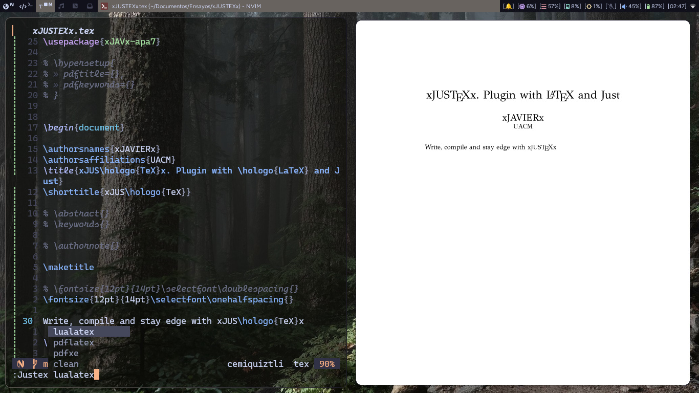
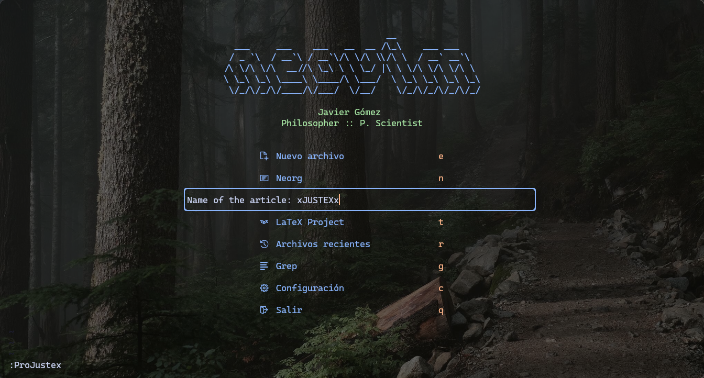
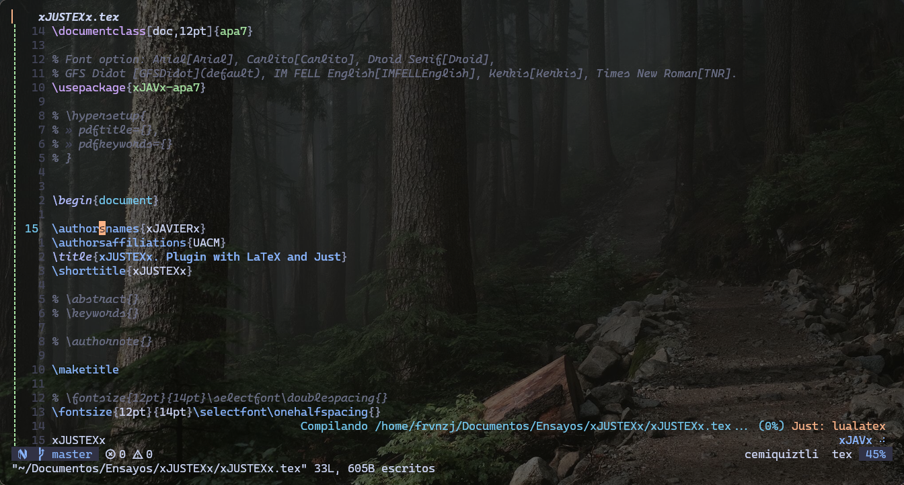

# xJUSTEXx



Hice este plugin con la idea de facilitar la creación de mis ensayos con LaTeX a través de Neovim. Mezclo la creación de proyectos (una estructura básica de workspace e inicialización de repositorio git) con el fácil acceso a los comandos de TeXlive para compilar a través Just y justfile.

I made this plugin with the idea of create project articleas easy with LaTeX and Neovim. This plugin create a project directory with the name of the project, a main.tex and a .justfile for compile.

## Tabla de Contenidos

- [Dependencias](#dependencias)
- [Instalación](#instalación)
- [Configuración](#configuración)
- [Uso](#uso)
- [Comandos](#comandos)
- [Opciones de Configuración](#opciones-de-configuración)
- [Contribuciones](#contribuciones)

## Dependencias

- Neovim >= 0.10
- Git
- Just
- fidget.nvim (opcional)
- [texclear](https://github.com/LukeSmithxyz/voidrice/blob/master/.local/bin/texclear) (opcional)

## Instalación / Install

Para instalar puedes usar el plugin manager que prefieras. El siguiente ejemplo es con [lazy.nvim](https://github.com/folke/lazy.nvim) y depende de [fidget.nvim](https://github.com/j-hui/fidget.nvim) para conocer el status de la compilación.

```lua
{
  "frvnzj/xJUSTEXx.nvim",
  dependencies = {
    "j-hui/fidget.nvim",
  },
  config = function()
    require("xJUSTEXx").setup()
  end,
}
```

## Configuración / Configuration

La configuración tiene tres opciones (directorio de los proyectos, plantilla o contenido con el que se iniciará el tex main y el contenido del .justfile que declara los comandos a usar). Las opciones por default son las siguientes:

The configuration have three options (project directories, template for main.tex and the content of .justfile with the commands for compile). The default setup is:

```lua
{
    project_dirs = { -- before init project you can choose the directory root
        vim.fn.expand('$HOME') .. '/Documents/Articles', -- use this format of expand
        vim.fn.expand('$HOME') .. '/Documents/Research',
    },
    tex_content = [[
\documentclass{article}

\begin{document}

\end{document}
]],
    justfile_content = [[
main_file := "%s.tex"

lualatex:
  @latexmk -lualatex -interaction=nonstopmode -synctex=-1 {{main_file}}

pdflatex:
  @latexmk -pdf -interaction=nonstopmode -synctex=-1 {{main_file}}

pdfxe:
  @latexmk -pdfxe -interaction=nonstopmode -synctex=-1 {{main_file}}

clean:
  @texclear {{main_file}}
]],
}
```

## Uso / Use



xJUSTEXx ofrece dos comandos: 1. crear proyecto (directorio único del proyecto, repositorio git y main file) y compilar utilizando optativamente LuaLaTeX, pdfLaTeX o XeLaTeX con la ayuda/dependencia de [Just](https://github.com/casey/just).

xJUSTEXx comes with two commands: 1. command for create projects (project directory with repository git, main tex file and .justile); 2. command for compile with LuaLaTeX, pdfLaTeX or XeLaTeX with the help of [Just](https://github.com/casey/just).

### Comandos / Commands

Para iniciar un proyecto nuevo de LaTeX usa el comando:

For init a new project of LaTeX use the command:

```lua
:ProJustex

-- o

require("xJUSTEXx").xTEXx()
```

Para compilar el proyecto utiliza el comando:

For compile the main.tex use the command:

```lua
:Justex lualatex -- pdflatex or pdfxe

-- o

require("xJUSTEXx").xJUSTEXx("lualatex")
```

## Opciones de Configuración / Change default configuration


La configuración no se limita a las 3 opciones disponibles a modificar del plugin. Por ejemplo, la configuración de uso personal para iniciar proyectos de ensayo:

You can change the default configuration, for example, I set my own template and directories:

```lua
require("xJUSTEXx").setup {
    tex_content = [[
\documentclass[doc,12pt]{apa7}

% Font option: Arial[Arial], Carlito[Carlito], Droid Serif[Droid],
% GFS Didot [GFSDidot](default), IM FELL English[IMFELLEnglish], Kerkis[Kerkis], Times New Roman[TNR].
\usepackage{xJAVx-apa7}

\addbibresource{~/Documentos/LaTeX/refs.bib}

% \hypersetup{
% 	pdftitle={<++>},
% 	pdfkeywords={<++>}
% }


\begin{document}

\authorsnames{<++>}
\authorsaffiliations{<++>}
\title{<++>}
\shorttitle{<++>}

% \abstract{<++>}
% \keywords{<++>}

% \authornote{<++>}

\maketitle

% \fontsize{12pt}{14pt}\selectfont\doublespacing{}
\fontsize{12pt}{14pt}\selectfont\onehalfspacing{}

<++>


% ----- Bibliografía -----
% \printbibliography
\end{document}
]],
    project_dirs = {
      vim.fn.expand "$HOME" .. "/Documentos/Ensayos",
      vim.fn.expand "$HOME" .. "/Documentos/Research",
    },
}
```



También es recomendable el uso de [which-key](https://github.com/folke/which-key.nvim) o nvim_set_keymap() en `ftplugin/tex.lua` y `ftplugin/plaintex.lua`, por ejemplo:

It is also recommended to use [which-key](https://github.com/folke/which-key.nvim) or nvim_set_keymap() in `ftplugin/tex.lua` y `ftplugin/plaintex.lua`, for example:

```lua
local wk = require("which-key")


wk.add {
  { "<leader>wa", "<cmd>Justex lualatex<cr>", desc = "xJAVx LuaLaTeX", icon = { icon = "", color = "azure" }, },
  { "<leader>wb", "<cmd>Justex pdflatex<cr>", desc = "xJAVx LaTeX", icon = { icon = "", color = "azure" }, },
  { "<leader>wc", "<cmd>Justex pdfxe<cr>", desc = "xJAVx XeLaTeX", icon = { icon = "", color = "azure" }, },
  { "<leader>wd", "<cmd>Justex clean<cr>", desc = "xJAVx CleanAuxFiles", icon = { icon = "", color = "azure" }, },
}

-- Estos keymaps permiten ir rápidamente a los sitios que quiero modificar,
-- por ejemplo, en \authorsnames{<++>} me lleva dentro de { } borrando <++>
-- permitiéndome ingresar el nombre \authorsnames{xJAVx}
vim.keymap.set("n", ",,", "<cmd>keepp /<++><cr>ca<", { noremap = true, silent = true })
vim.keymap.set("i", ",,", "<esc>0<cmd>keepp /<++><cr>ca<", { noremap = true, silent = true })
```

## Contribuciones

Si deseas contribuir mejorando el plugin o reportar errores, quedo atento.

### License MIT
